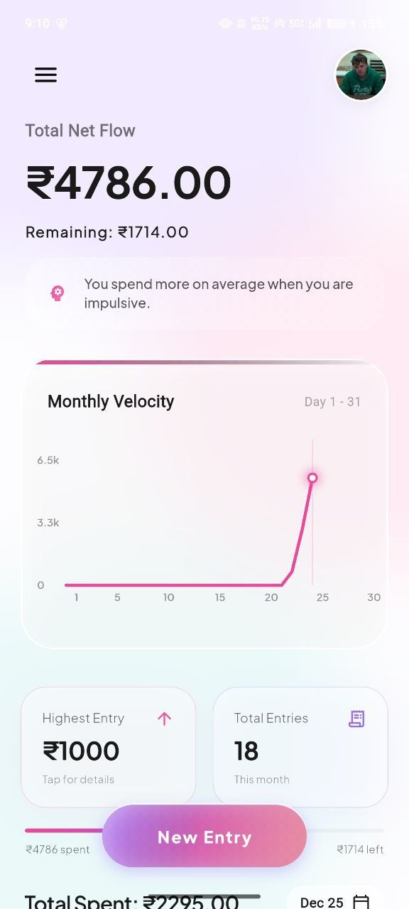
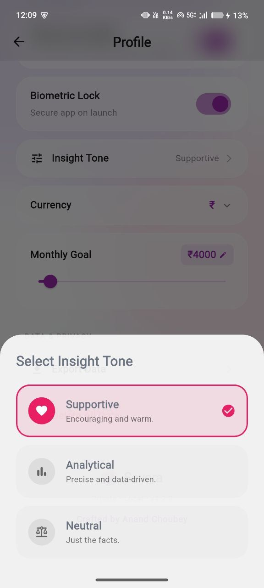
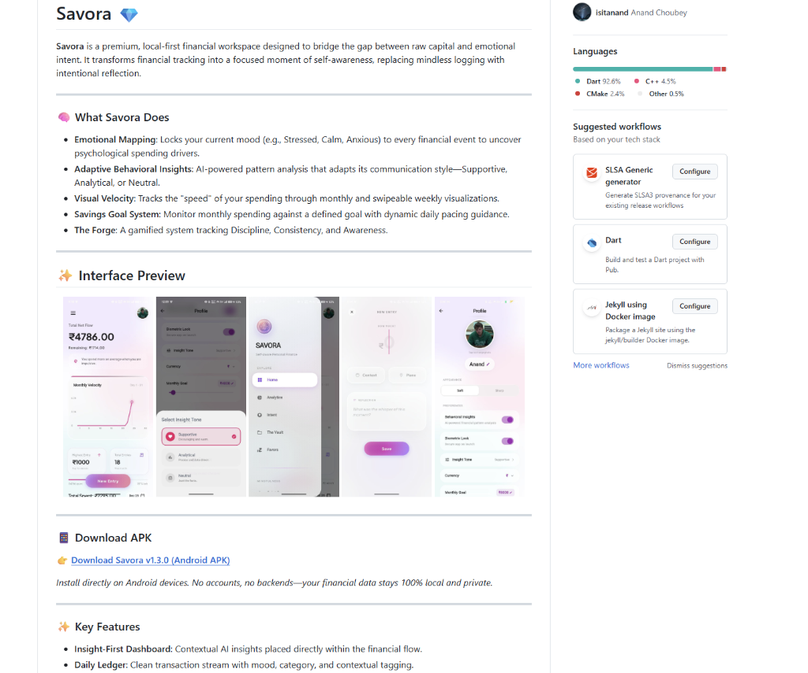
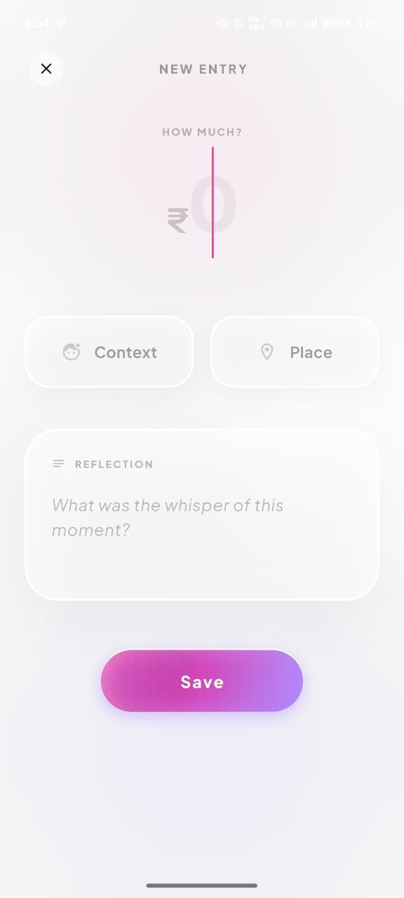
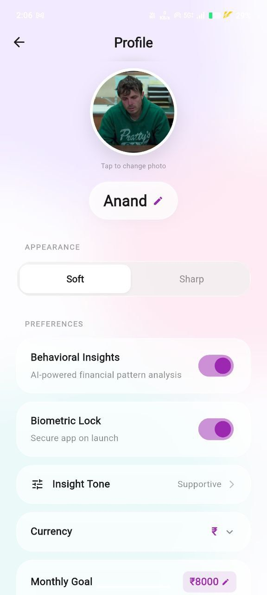
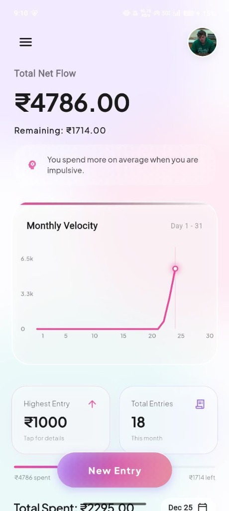
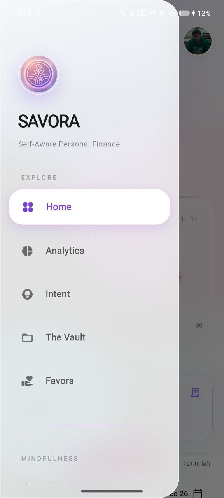

# Savora 💎
Manage financial intent with emotional clarity

---

## 📋 Project Brief

| **PROBLEM** | **SOLUTION** |
| :--- | :--- |
| Mindless financial tracking ignores the psychological drivers of spending. There's no simple way to see the connection between raw capital and your emotional intent. | A premium design system that locks your current mood to every transaction. It surfaces behavioral patterns, tracks "visual velocity," and gamifies awareness—built with local-first privacy at its core. |

### ✨ Key Features

*   **Emotional Mapping**: Locks mood, energy, and stress levels to every financial event.
*   **Adaptive Behavioral Insights**: AI-powered pattern analysis with selectable communication tones.
*   **Visual Velocity**: Dynamic monthly and swipeable weekly traces of your spending speed.
*   **The Forge**: A gamified tracking system for Discipline, Consistency, and Awareness.
*   **Local-First Architecture**: 100% on-device JSON storage—no accounts, no trackers.
*   **Biometric Security**: Native device-level authentication to secure your workspace.

### 🛠 Tech Stack
`Flutter` `Local JSON` `AI Pattern Analysis` `Biometrics`

### 🔗 Quick Links
[**Download APK**](https://github.com/isitanand/savora-app/releases/download/v1.2.0/Savora-v1.3.release.apk) | [**View Demo**](https://youtube.com/shorts/7w4-r_4OiTM)

---

## ✨ Interface Preview

<p align="center">
  
  
  
  
  
  
  
</p>

<p align="center">
  👉 <b><a href="https://youtube.com/shorts/7w4-r_4OiTM">View Video Demo</a></b>
</p>

---

### 📱 Download APK

👉 [**Download Savora v1.3.0 (Android APK)**](https://github.com/isitanand/savora-app/releases/download/v1.2.0/Savora-v1.3.release.apk)

*Install directly on Android devices. No accounts, no backends—your financial data stays 100% local and private.*

---

### 🛠️ Architecture & Tech

Built with **Flutter** for a high-performance native experience.

* **UI Design**: Premium "Soft-Glass" aesthetic using BackdropFilters and gradients.
* **Architecture**: Clean separation using Repository Pattern.
* **Persistence**: Local JSON storage (fully offline, no backend).

---

### 🔒 Privacy

* **No Accounts Required**
* **100% On-Device Storage**
* **Full Data Ownership (Export / Delete anytime)**

---

### ⚙️ Run Locally

```bash
git clone https://github.com/isitanand/savora-app.git
cd savora-app
flutter pub get
flutter run
```

---

### 👤 Author

**Anand Choubey**
